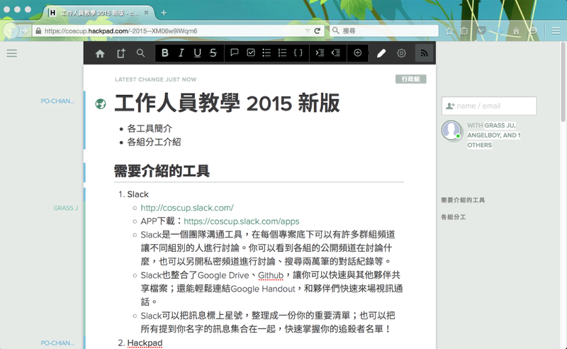
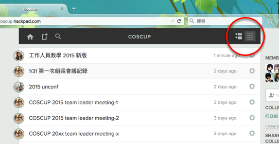
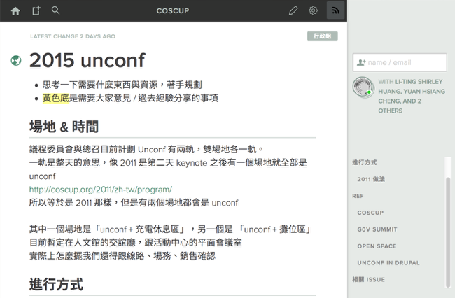
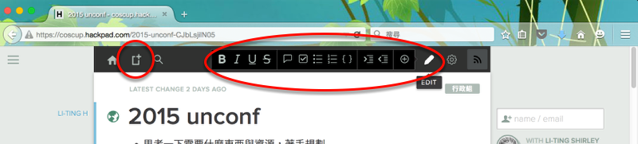
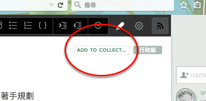

# 多人共同編輯文件，就是 Hackpad

Hackpad是可以多人線上共同編輯文件的工具，COSCUP 的 Hackpad 在 [http://coscup.hackpad.com](http://coscup.hackpad.com)

這裡有整理後的會議紀錄、信件範例

也可以拿來規劃專案，蒐集大家意見

可以用工具列來開啟新頁，或調整文字格式

寫好的文件可以放進 Collection，並開放讓大家使用

Hackpad 也能設定權限，方便你僅邀請部分人參與

