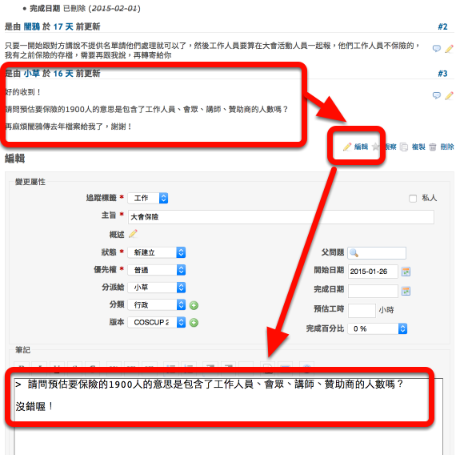

# 事情做完沒？查查 Redmine

Redmine 是所謂的工作追蹤系統，用來分配工作和追蹤進度的工具

在帳號開通後，可以由 https://issues.coscup.org/ 進入
在上面每個人都可以看到自己和其他人負責的工作內容與工作進度

這邊一條一條的項目，稱之為一個「issue」或「票」 （類似工作需求申請單那類的東西）。對 COSCUP 這種跨地域、由志工非同步工作的專案來說，這樣的系統是很重要的！

除了顧好自己要做的事情之外，也能在適當的時候給予其他人協助或工作建議。

要叫別人做事、或者事情做到一半要問問題，就分派過去

事情做完，記得還給原來開票的人，告訴他你完成了

這樣他就可以確認後關票

關於各種狀態的意義，我們有詳細流程圖唷！工作流程請參考：

（點擊看大圖）

小技巧：http://issues.coscup.org/my/page 是可以自訂內容的唷

