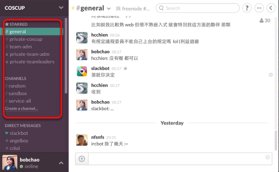

# 團隊溝通工具「Slack」快速介紹

Slack是一個團隊溝通工具

在每個專案底下可以有許多群組頻道，讓不同組別的人進行討論。你也可以開設自己的專案頻道。

你可以用瀏覽器直接上 coscup.slack.com 網站

或下載 Mac / iOS / Android APP 方便使用

你可以看到各組的公開頻道在討論什麼，也可以另開私密頻道進行討論、搜尋對話紀錄等

Slack也可以快速與其他夥伴共享檔案

還能輕鬆連結Google Handout，和夥伴們快速來場視訊通話
Slack可以把訊息標上星號，整理成一份你的重要清單

也可以把所有提到你名字的訊息集合在一起，快速掌握你的追殺者名單！